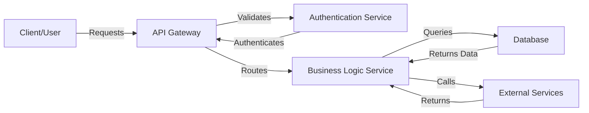

# Architecture Overview

## Data Flow Diagram

## Component Description

- **Client/User**: Entry point for all system requests
- **API Gateway**: Manages request routing and load balancing
- **Authentication Service**: Handles user authentication and authorization
- **Business Logic Service**: Processes core application logic
- **Database**: Persistent data storage
- **External Services**: Third-party integrations and APIs